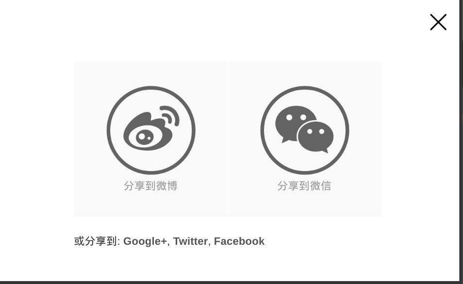

# more-basic-share

这个插件是对[青谷](https://www.qinco.net/basicshare)的 basicshare.js 的增强，特别感谢[青谷](https://www.qinco.net)。

>社会化分享是很多网站常用的功能之一，国内也有很多专业的公司在做，比较出名的包括 j*this，B*hare 等。不过很悲伤的是，这些公司的产品，无一利额外的具有一个特点：奇丑无比。丑就算了，还不允许别人修改其设计，结果就是，再好的UI设计也毁在这些插件手里了。 ---- [青谷](https://www.qinco.net/basicshare)

这个插件风格极简，但是功能上不完全符合我的需求，所以我对它做了几点升级：

* 增加了 Google+, twitter, facebook 等国外社交网站的分享；
* Share Url 和 Pic Url 支持相对路径；
* 上传到了又拍云的 CDN 服务器上，支持 HTTPS 加载。加载地址： https://revir.b0.upaiyun.com/lib/more-basic-share-0.1.js

# Demo

参考效果见 [V2MM](https://v2mm.tech/) ， V2MM 上每个帖子和回复都可以分享；

**截图**

# 使用方式

与[青谷](https://www.qinco.net/basicshare)的 basicshare.js 原理一样：

1、加载 jquery 库：

    

2、在 `</body>` 之前调用以下 js 文件：

    

3、在网页的任何位置，加入一个class属性包含 basicShareBtn 的按钮或链接即可：

    <button class='basicShareBtn'>分享</button>
    <a class='basicShareBtn' href='#' >分享</a>

4、高级设置（自定义网址等），此处 shareUrl 和 shareTitle 支持以 “/” 开头的相对路径：

    <button class='basicShareBtn'
        data-shareUrl='http://example.com/customize'
        data-shareTitle='自定义分享标题'
        data-sharePic='自定义图片的网址（适用于微博）'>分享</button>
